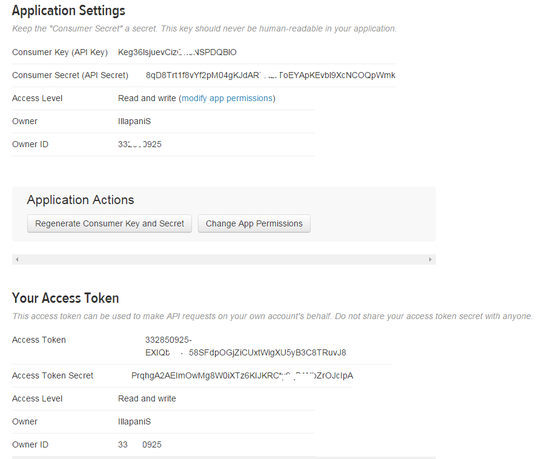

### Introduction:  

  This project is about doing sentiment analysis of social media data on a specific topic or personality.
  It is about analyzing the mood about a certain Keyword in the feeds posted by general public.
  
  Twitter is a popular social media site where many popular personalities from various strata of the
  society post their opinions and comments in a 140 character limit post. For this project we will focus
  on the current leading personalities running for the 2016 US Presidential elcections from the two major parties.
  
  We will focus on tweets posted in reference to Donald Trump and Hillary Clinton.
  
  We get a number of tweets which contain a keyword you can define, filter out the text of these tweets
  and then see if there are more positive or negative words that characterize the tweets that are generated
  using the hash tags for each of the two candidates.
  

### Data sourcing and permissions:  

  Twitter API requires OAuth handshake for connecting and making data requests. 
  For this work, a new app need to be created in Twitter. Got to https://dev.twitter.com/ and log in with your Twitter        Account. Click on "Create new application" and name your Application and also set some description. Twitter requires a      valid URL for the website, one can just type in http://test.net
  
  Click on Create and one will get redirected to a screen with all the OAuth setting info of the new App.
  
  Make a note of the following four keys:
  consumer_key
  consumer_secret
  access_token
  access_secret
  
  Here is the screenshot of the Twitter app setings:
  
  
  
  
### Packages

  For sentiment analysis we are leveraging the R package called "sentiment". It has two handy
  functions serving our need:
  
  classify_emotion
  classify_polarity

  The sentiment package can be downloaded from - http://www.omegahat.org/Rstem/
  
  The "twitteR" package provides an interface to the Twitter web API. It can be downloaded from -                             https://cran.r-project.org/web/packages/twitteR/index.html
  

```{r, eval=TRUE}
# Load the necessary packages to be used for this project
library(twitteR)
library(sentiment)
library(plyr)
library(ggplot2)
library(RColorBrewer)
library(knitr)
```

### Source connection - Keys and Tokens 

The OAuth keys obtained by following the above instructions are used here for direct authentication with
Twitter before we start pulling the tweets.


```{r, eval=TRUE}
consumer_key <- 'Keg36lsjuevCizGh6NSPDQBlO'
consumer_secret <- '8qD8Trt1f8vYf2pM04gKJdARXKLrToEYApKEvbl9XcNCOQpWmk'
access_token <- '332850925-EXIQbHGC58SFdpOGjZiCUxtWigXU5yB3C8TRuvJ8'
access_secret <- 'PrqhgA2AEImOwMg8W0iXTz6KIJKRCty9qB1NbZrOJcIpA'

# This function wraps the OAuth authentication handshake functions
setup_twitter_oauth(consumer_key,
                    consumer_secret,
                    access_token,
                    access_secret)

```


```{r, eval=TRUE}
# grab tweets for Donald Trump
T_tweets = searchTwitter("@realDonaldTrump", n=1500, lang="en")

# grab tweets for Hillary Clinton
C_tweets = searchTwitter("@HillaryClinton", n=1500, lang="en")

```

### Data Cleanup and formatting

```{r, eval=TRUE}
# get the text
T_txt = sapply(T_tweets, function(x) x$getText())
C_txt = sapply(C_tweets, function(x) x$getText())

# write the tweets to a csv file. Tweets change each time they are pulled. This file will be 
# a copy of the feed obtained when the tweets were last harvested 
write.csv(T_txt, file ="SI_finalproject_T_tweets.csv")
write.csv(C_txt, file ="SI_finalproject_C_tweets.csv")

# remove retweet entities
T_txt = gsub("(RT|via)((?:\\b\\W*@\\w+)+)", "", T_txt)
# remove @users
T_txt = gsub("@\\w+", "", T_txt)
# remove punctuations
T_txt = gsub("[[:punct:]]", "", T_txt)
# remove numbers
T_txt = gsub("[[:digit:]]", "", T_txt)
# remove html links
T_txt = gsub("http\\w+", "", T_txt)
# remove unnecessary spaces
T_txt = gsub("[ \t]{2,}", "", T_txt)
T_txt = gsub("^\\s+|\\s+$", "", T_txt)


# remove retweet entities
C_txt = gsub("(RT|via)((?:\\b\\W*@\\w+)+)", "", C_txt)
# remove @users
C_txt = gsub("@\\w+", "", C_txt)
# remove punctuations
C_txt = gsub("[[:punct:]]", "", C_txt)
# remove numbers
C_txt = gsub("[[:digit:]]", "", C_txt)
# remove html links
C_txt = gsub("http\\w+", "", C_txt)
# remove unnecessary spaces
C_txt = gsub("[ \t]{2,}", "", C_txt)
C_txt = gsub("^\\s+|\\s+$", "", C_txt)


# change to lowercase function 
tryTolower = function(x)
{
  # create missing value
  y = NA
  # tryCatch error
  try_error = tryCatch(tolower(x), error=function(e) e)
  # if not an error
  if (!inherits(try_error, "error"))
    y = tolower(x)
  # result
  return(y)
}

# lower case using tryTolower with sapply 
T_txt = sapply(T_txt, tryTolower)
C_txt = sapply(C_txt, tryTolower)

# remove duplicate or repeated tweets
T_txt = unique(T_txt)
C_txt = unique(C_txt)
```


### Sentiment Analysis

```{r, eval=TRUE}
# set emotion to tweets (sadness, joy, anger, etc.)
T_emo = classify_emotion(T_txt, algorithm="bayes")
C_emo = classify_emotion(C_txt, algorithm="bayes")


# get emotion best fit
T_emotion = T_emo[,7]
C_emotion = C_emo[,7]

# substitute NA's by "unknown"
T_emotion[is.na(T_emotion)] = "unknown"
C_emotion[is.na(C_emotion)] = "unknown"

# set polarity based on the emotion (positive, negative or unknown)
T_pol = classify_polarity(T_txt, algorithm="bayes")
C_pol = classify_polarity(C_txt, algorithm="bayes")

# get polarity best fit
T_polarity = T_pol[,4]
C_polarity = C_pol[,4]

# create a data frame with results
T_df = data.frame(text=T_txt, emotion=T_emotion,
                     polarity=T_polarity, stringsAsFactors=FALSE)

C_df = data.frame(text=C_txt, emotion=C_emotion,
                     polarity=C_polarity, stringsAsFactors=FALSE)

kable(head(T_df))


kable(head(C_df))
```


### Plots for the obtained results


```{r, eval=TRUE}
# distribution of emotions
ggplot(T_df, aes(x=T_emotion)) +
geom_bar(aes(y=..count.., fill=T_emotion)) +
scale_fill_brewer(palette="Dark2") +
labs(x="Emotion", y="Number of tweets") +
labs(title = "Sentiment Analysis of Tweets about Donald Trump\n(classification by emotion)",
     plot.title = element_text(size="12"))


ggplot(C_df, aes(x=C_emotion)) +
geom_bar(aes(y=..count.., fill=C_emotion)) +
scale_fill_brewer(palette="Dark2") +
labs(x="Emotion", y="Number of tweets") +
labs(title = "Sentiment Analysis of Tweets about Hillary Clinton\n(classification by emotion)",
     plot.title = element_text(size="12"))

# distribution of polarity
ggplot(T_df, aes(x=T_polarity)) +
geom_bar(aes(y=..count.., fill=T_polarity)) +
scale_fill_brewer(palette="RdGy") +
labs(x="Polarity", y="Number of tweets") +
labs(title = "Sentiment Analysis of Tweets about Donald Trump\n(classification by polarity)",
    plot.title = element_text(size="12"))

ggplot(C_df, aes(x=C_polarity)) +
geom_bar(aes(y=..count.., fill=C_polarity)) +
scale_fill_brewer(palette="RdGy") +
labs(x="Polarity", y="Number of tweets") +
labs(title = "Sentiment Analysis of Tweets about Hillary Clinton\n(classification by polarity)",
    plot.title = element_text(size="12"))
```


### Conclusion:  

The number of tweets sourced from Twitter for each candidate were set at 1500 and it was found that many
of them were duplicate tweets. When unique tweets were selected, the record count reduced by half.

Based on the plots, both the candidates have around 500 tweets that were categorized as "unknown"
on the emotional sentiment. This number constitutes around 70% of the total tweets and does not really 
help us as a majority of them cannot be classified.

The polarity aspect of the sentiment though had all the 700 or so unique tweets classified as either positive,
negative or neutral, even the tweets categorized as "unknown" for emotion.

On close inspection both the candidates have similar number of tweets spread around emotional aspects
and also the polarity aspects.

One should also make a note that the tweets pulled are based on the time they were pulled. The trend could go either
way based on the type of election rhetoric is trending across the nation. 

There have been other sentiment analysis studies done based on Twitter feeds and further research could be done
to find more accurate algorithms and packages that could do better sentimental analysis and hence better results.


### References:  


Mining Twitter with R - Sentiment Analysis with "sentiment" by Gaston Sanchez  

Twitter for developers - https://dev.twitter.com/  

Visualizing Twitter Sentiment by Healey & Ramaswamy - http://www.csc.ncsu.edu/faculty/healey/tweet_viz/  


  
  


